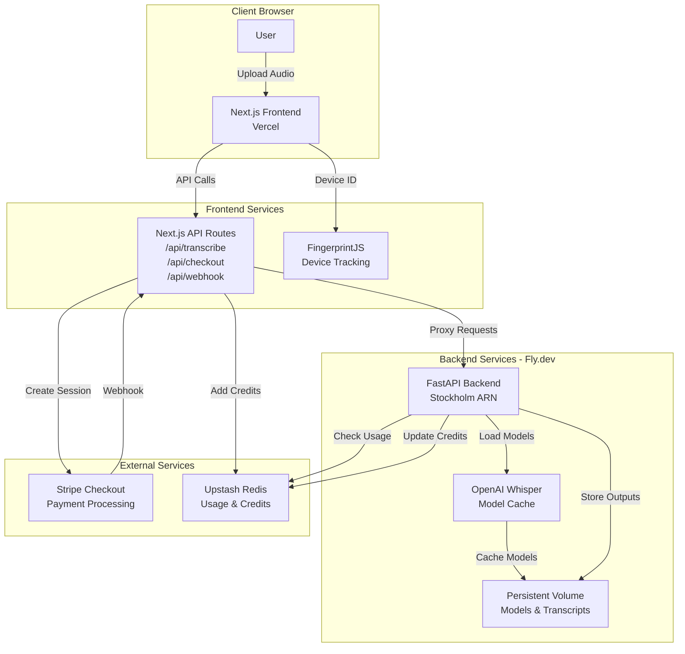

<table style="margin-bottom: 0">
<tr>
<td valign="top">

<h1>Catscribe - Audio Transcription Service</h1>

<p><strong>Try the app right now:</strong> <a href="https://catscribe.admitted.dk">catscribe.admitted.dk</a> | <span style="color: blue;"><a href="https://catscribe.vercel.app" style="color: blue;">Mirror</a></span></p>

<p>A open source web app for transcribing interviews using faster-whisper, with a functioning stripe payment system, focused on privacy.
The app stores none of your data:</p>
<ul>
<li>Immediately deletes your audio after transcriptions</li>
<li>Deletes your transcripts after you've downloaded them or closed the tab in your browser</li>
</ul>

</td>
<td valign="top" align="right">

<div style="display: flex; gap: 8px;"></div>


</td>
</tr>
</table>

## Architecture

- **Frontend**: Next.js 14 on Vercel
- **Backend**: FastAPI (Python) on Fly.dev
- **Transcription**: faster-whisper (local models for privacy)
- **Database**: Upstash Redis
- **Payments**: Stripe Checkout

### Architecture Diagram



### Data Flow

1. **File Upload**: User uploads audio → Frontend → Backend API
2. **Transcription**: Backend loads Whisper model → Processes audio → Stores results
3. **Usage Tracking**: Backend checks Redis for free tier limits
4. **Payment Flow**: User purchases credits → Stripe Checkout → Webhook → Redis credits updated
5. **Result Retrieval**: User downloads transcription files from backend storage

## Features

- Drag-and-drop audio file upload
- Multiple language support with auto-detection
- 5 model quality tiers (tiny to large)
- Free tier: 3 tiny/base + 1 small transcriptions
- Paid tier: Pay-per-use credits, max 3 hours per file
- Transcription outputs stored for 7 days (.txt, .srt, .vtt)
- Device fingerprinting for usage tracking
- Stripe Checkout integration for credit purchases

## Local Development

### Prerequisites

- Docker and Docker Compose
- Node.js 18+ (for frontend)
- Python 3.11+ (for backend, optional)

### Backend Setup

```bash
cd backend
pip install -r requirements.txt
uvicorn app.main:app --reload
```

Or use Docker:

```bash
docker-compose up backend
```

### Frontend Setup

```bash
cd frontend
npm install
npm run dev
```

### Environment Variables

#### Backend (.env or fly secrets)

```
REDIS_URL=redis://...
API_KEY=your-secret-api-key
ALLOWED_ORIGINS=https://your-app.vercel.app
```

## Security

- File type validation
- Duration limits (45min free, 3hr paid)
- Rate limiting (10 req/hour)
- API key authentication
- Stripe webhook signature verification
- CORS protection
- Security headers (CSP, X-Frame-Options, etc.)

## Credit Pricing

| Tier    | Description                                  |
|---------|----------------------------------------------|
| Free    | Free allowance: 45 minutes (3 tiny/base + 1 small)        |
| Premium | Pay-per-use: minute packages (30, 60, 120 min) |

### Pricing config

Minute package prices, currency, and admin pricing are defined in **`frontend/app/config/pricing.ts`**. Edit that file to change amounts or add/remove packages.

| Field | Description |
|-------|-------------|
| `currency` | Stripe currency code (`"dkk"`, `"eur"`, `"usd"`). Amounts are sent to Stripe in the smallest unit (øre for DKK, cents for EUR/USD), so each `price` is multiplied by 100. |
| `adminPrice` | Price in the main unit (e.g. DKK) for the admin email. |
| `adminEmail` | Email that receives the admin price. |
| `currencyDisplay` | Suffix shown in the UI (e.g. `"kr."` for `35 kr.`). |
| `packages` | Array of `{ id, minutes, price }`. `id` must stay in sync with the checkout API; `price` is in the main unit (e.g. DKK). |

Example: to add a 90‑minute package at 15 kr., add `{ id: "xlarge", minutes: 90, price: 15 }` to `packages` and use `id: "xlarge"` when calling `/api/checkout`.

## License

MIT
