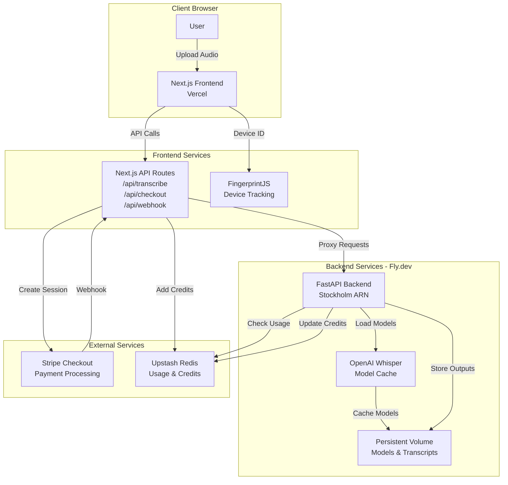

# Catscribe - Audio Transcription Service

A web application for transcribing audio files using OpenAI Whisper, with a free tier and pay-per-use credits.

## Architecture

- **Frontend**: Next.js 14 on Vercel
- **Backend**: FastAPI (Python) on Fly.dev
- **Transcription**: OpenAI Whisper (local models)
- **Database**: Upstash Redis
- **Payments**: Stripe Checkout

### Architecture Diagram



### Data Flow

1. **File Upload**: User uploads audio → Frontend → Backend API
2. **Transcription**: Backend loads Whisper model → Processes audio → Stores results
3. **Usage Tracking**: Backend checks Redis for free tier limits
4. **Payment Flow**: User purchases credits → Stripe Checkout → Webhook → Redis credits updated
5. **Result Retrieval**: User downloads transcription files from backend storage

## Features

- Drag-and-drop audio file upload
- Multiple language support with auto-detection
- 5 model quality tiers (tiny to large)
- Free tier: 3 tiny/base + 1 small transcriptions
- Paid tier: Pay-per-use credits, max 3 hours per file
- Transcription outputs stored for 7 days (.txt, .srt, .vtt)
- Device fingerprinting for usage tracking
- Stripe Checkout integration for credit purchases
- Admin pricing: Special 2 kr. pricing for <admin@admitted.dk>

## Local Development

### Prerequisites

- Docker and Docker Compose
- Node.js 18+ (for frontend)
- Python 3.11+ (for backend, optional)

### Backend Setup

```bash
cd backend
pip install -r requirements.txt
uvicorn app.main:app --reload
```

Or use Docker:

```bash
docker-compose up backend
```

### Frontend Setup

```bash
cd frontend
npm install
npm run dev
```

### Environment Variables

#### Backend (.env or fly secrets)

```
REDIS_URL=redis://...
API_KEY=your-secret-api-key
ALLOWED_ORIGINS=https://your-app.vercel.app
```

#### Frontend (.env.local)

```
BACKEND_URL=https://catscribe-backend.fly.dev
API_KEY=your-secret-api-key
FRONTEND_URL=https://frontend-taupe-six-42.vercel.app
NEXT_PUBLIC_FRONTEND_URL=https://frontend-taupe-six-42.vercel.app
NEXT_PUBLIC_API_URL=https://catscribe-backend.fly.dev
STRIPE_SECRET_KEY=sk_test_... (or sk_live_...)
STRIPE_WEBHOOK_SECRET=whsec_...
```

See `frontend/.env.local.example` for a template.

## Deployment

### Current Deployment Status

- **Frontend**: ✅ Deployed at <https://frontend-taupe-six-42.vercel.app>
- **Backend**: ✅ Deployed at <https://catscribe-backend.fly.dev>
- **Region**: Stockholm (ARN)
- **Redis**: Upstash Redis (solitary-wind-5060)

See [DEPLOYMENT.md](DEPLOYMENT.md) for detailed deployment instructions.

### Backend (Fly.dev)

1. Install Fly CLI: `curl -L https://fly.io/install.sh | sh`
2. Login: `fly auth login`
3. Create app: `fly apps create catscribe-backend`
4. Create volume: `fly volumes create catscribe_data --size 10 --region arn`
5. Create Redis: `fly redis create catscribe-redis --region arn`
6. Set secrets:

   ```bash
   fly secrets set REDIS_URL=...
   fly secrets set API_KEY=...
   fly secrets set ALLOWED_ORIGINS=...
   ```

7. Deploy: `fly deploy`

### Frontend (Vercel)

1. Install Vercel CLI: `npm i -g vercel`
2. Login: `vercel login`
3. Deploy: `vercel --prod`
4. Set environment variables:

   ```bash
   vercel env add BACKEND_URL production
   vercel env add API_KEY production
   vercel env add STRIPE_SECRET_KEY production
   vercel env add STRIPE_WEBHOOK_SECRET production
   # ... etc
   ```

5. Redeploy: `vercel --prod`

## Security

- File type validation (magic bytes)
- Duration limits (45min free, 3hr paid)
- Rate limiting (10 req/hour)
- API key authentication
- Stripe webhook signature verification
- CORS protection
- Security headers (CSP, X-Frame-Options, etc.)

## Credit Pricing

| Tier    | Description                                  |
|---------|----------------------------------------------|
| Free    | Free allowance: 45 minutes (3 tiny/base + 1 small)        |
| Premium | Pay-per-use: minute packages (30, 60, 120 min) |

### Pricing config

Minute package prices, currency, and admin pricing are defined in **`frontend/app/config/pricing.ts`**. Edit that file to change amounts or add/remove packages.

| Field | Description |
|-------|-------------|
| `currency` | Stripe currency code (`"dkk"`, `"eur"`, `"usd"`). Amounts are sent to Stripe in the smallest unit (øre for DKK, cents for EUR/USD), so each `price` is multiplied by 100. |
| `adminPrice` | Price in the main unit (e.g. DKK) for the admin email. |
| `adminEmail` | Email that receives the admin price. |
| `currencyDisplay` | Suffix shown in the UI (e.g. `"kr."` for `35 kr.`). |
| `packages` | Array of `{ id, minutes, price }`. `id` must stay in sync with the checkout API; `price` is in the main unit (e.g. DKK). |

Example: to add a 90‑minute package at 15 kr., add `{ id: "xlarge", minutes: 90, price: 15 }` to `packages` and use `id: "xlarge"` when calling `/api/checkout`.

Default packages: 30 min / 5 kr., 60 min / 10 kr., 120 min / 20 kr. Admin: `admin@admitted.dk` at 2 kr.

#### Your cost on Fly.io

Paid users are charged 1 minute per 1 minute of audio, regardless of model. Your Fly bill depends on **compute time** (how long the transcription runs).

- **Fly.io**: 2 shared CPUs + 2 GB RAM ≈ $0.0044/s (~16 DKK/h). Whisper **tiny/base/small/medium** fit in 2 GB and run at roughly 5–40× faster than realtime on 2 CPUs, so 60 min of audio is typically a few minutes of compute—well under 10 DKK.
- **Whisper large** needs ~3–6+ GB RAM. On a 2 GB machine it will not load or will OOM/swap heavily, so in practice **large is not viable** on the current Fly sizing. If you later move to 8 GB+ and support large, 60 min of large can approach 1–2× realtime (60–120 min compute) and could cost you more than 10 DKK; consider then either higher prices or deducting more minutes per audio-minute for the large model.

## License

MIT
