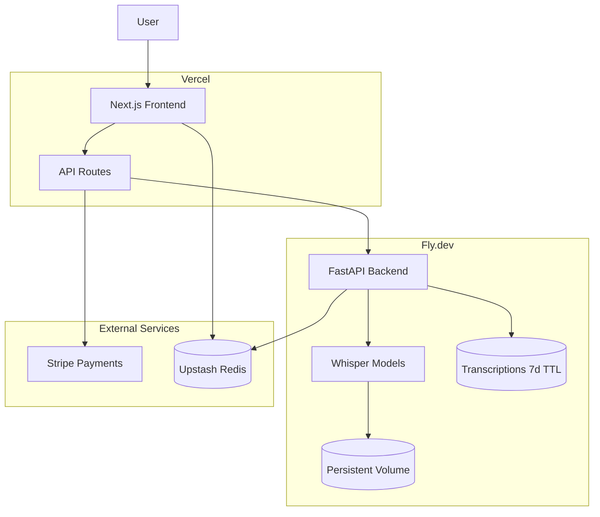

# Whisper Transcription Web App

## Architecture Overview



## Tech Stack

| Layer | Technology | Rationale |

|-------|------------|-----------|

| Frontend | Next.js 14 (App Router) | Vercel-optimized, great DX, server actions |

| Backend | FastAPI (Python) | Async, fast, OpenAPI docs, Python ecosystem |

| Transcription | OpenAI Whisper | Local models, no API costs per transcription |

| Database | Upstash Redis | Serverless, tracks usage/fingerprints, cheap |

| Payments | Stripe Checkout | Pay-per-use credits, industry standard |

| Output Storage | Fly Volume + Redis | .txt/.srt stored 7 days, audio deleted immediately |

| Deployment | Vercel + Fly.dev | Frontend edge, backend with GPU option |

## Core Features (MVP)

### 1. Frontend (Next.js on Vercel)

- Drag-and-drop file upload with progress indicator
- Language selector dropdown (auto-detect + 50+ languages)
- Model quality selector: `tiny`, `base`, `small`, `medium`, `large`
- Credit balance display (for paid users)
- Real-time transcription status via polling/SSE
- Download transcription as `.txt`, `.srt`, `.vtt`

### 2. Backend (FastAPI on Fly.dev)

- `/transcribe` endpoint accepting audio files
- Whisper model loading with caching via Fly volumes
- Background task processing with status updates
- Model quality tiers with different processing times
- `/download/{job_id}/{format}` endpoint for retrieving outputs
- Audio files deleted immediately after transcription
- Transcription outputs (.txt, .srt, .vtt) stored for 7 days
- Hourly cleanup task to purge expired transcriptions

### 3. Free Trial System (Hybrid Auth)

- **Anonymous users**: Device fingerprint (FingerprintJS) + IP tracking
- **Transcription limits**: 3 transcriptions on `tiny`/`base` + 1 on `small`
- **Duration limits**: Max 45 minutes per file (free tier)
- **Storage**: Upstash Redis with fingerprint as key
- **Bypass mitigation**: Combine fingerprint + IP + rate limiting

### 4. Payment Flow (Stripe)

- Email collection required before payment
- Credit packages: e.g., 30min/$5, 60min/$9, 120min/$15
- Stripe Checkout Session for payment
- Webhook to credit account on successful payment
- Usage deduction based on audio duration + model tier
- **Duration limit**: Max 3 hours per file (paid users)

## Project Structure

```
catscribe/
├── frontend/                 # Next.js app
│   ├── app/
│   │   ├── page.tsx         # Main upload interface
│   │   ├── api/
│   │   │   ├── transcribe/  # Proxy to backend
│   │   │   ├── credits/     # Check/purchase credits
│   │   │   └── webhook/     # Stripe webhook
│   │   └── components/
│   ├── Dockerfile           # For local dev consistency
│   └── package.json
│
├── backend/                  # FastAPI app
│   ├── app/
│   │   ├── main.py          # FastAPI app, routes
│   │   ├── transcription.py # Whisper logic
│   │   ├── storage.py       # File storage + 7-day cleanup
│   │   ├── security.py      # File validation, rate limiting, API auth
│   │   ├── models.py        # Pydantic schemas
│   │   └── redis_client.py  # Upstash connection
│   ├── Dockerfile           # Production container
│   ├── requirements.txt
│   └── fly.toml             # Fly.dev config
│
├── docker-compose.yml        # Local development
└── README.md
```

## File Storage Strategy

**Audio files**: Deleted immediately after successful transcription (privacy + storage savings)

**Transcription outputs**: Stored for 7 days on Fly volume, then auto-deleted

```
/data/
├── whisper_models/          # Cached Whisper models (persistent)
└── transcriptions/          # Output files (7-day TTL)
    └── {fingerprint_hash}/
        └── {job_id}/
            ├── output.txt
            ├── output.srt
            ├── output.vtt
            └── metadata.json  # created_at, expires_at, etc.
```

**Cleanup mechanism**:

- Redis stores job metadata with TTL (7 days)
- Background task runs hourly to delete expired files from volume
- `/transcriptions/{job_id}` endpoint returns files or 404 if expired

**Retrieval flow**:

1. User completes transcription → gets unique `job_id`
2. User can download `.txt` or `.srt` via `/download/{job_id}/{format}`
3. Link works for 7 days, then files are purged

## Model Caching Strategy

Fly.dev persistent volumes will store downloaded Whisper models:

```python
# Model cache location on Fly volume
WHISPER_CACHE_DIR = "/data/whisper_models"
os.environ["XDG_CACHE_HOME"] = "/data"

# Models loaded once, cached in memory + disk
model_cache = {}
def get_model(size: str):
    if size not in model_cache:
        model_cache[size] = whisper.load_model(size, download_root=WHISPER_CACHE_DIR)
    return model_cache[size]
```

## Credit Pricing (Example)

| Model | Multiplier | 1 min audio cost |

|-------|------------|------------------|

| tiny | 0.5x | 0.5 credits |

| base | 1x | 1 credit |

| small | 2x | 2 credits |

| medium | 4x | 4 credits |

| large | 8x | 8 credits |

Packages: 50 credits/$5, 120 credits/$10, 300 credits/$20

## Security

### File Upload Validation

- Allowed formats: `.mp3`, `.wav`, `.m4a`, `.ogg`, `.flac`, `.webm`
- Magic byte verification (actual file type, not just extension)
- Max file size: 500MB
- Filename sanitization

### Duration Limits

| Tier | Max Duration |

|------|--------------|

| Free | 45 minutes |

| Paid | 3 hours |

Duration extracted from audio metadata before processing; rejected if over limit.

### Rate Limiting

- 10 requests/hour per fingerprint (even for paid users)
- Prevents API abuse and runaway costs

### API Security

- Shared API key between Vercel and Fly.dev
- Strict CORS (only allow production domain)
- Stripe webhook signature verification

### Headers (Frontend)

- `X-Content-Type-Options: nosniff`
- `X-Frame-Options: DENY`
- Content Security Policy

## Implementation Phases

### Phase 1: Core Infrastructure

- Set up Next.js project with Tailwind CSS
- Set up FastAPI project with Docker
- Basic file upload and transcription working locally
- Whisper integration with model selection
- Security module: file validation, duration check, rate limiting

### Phase 2: Usage Tracking and Free Tier

- Integrate FingerprintJS for device fingerprinting
- Set up Upstash Redis for usage tracking
- Implement free tier limits (3 tiny/base + 1 small)
- Add rate limiting

### Phase 3: Payments

- Stripe integration with Checkout Sessions
- Email collection flow before payment
- Credit purchase and balance tracking
- Webhook for payment confirmation

### Phase 4: Deployment

- Deploy frontend to Vercel
- Deploy backend to Fly.dev with persistent volume
- Configure environment variables and secrets
- Set up Stripe webhook endpoint

## Backlog

- MobilePay integration (Danish payments)
- User accounts with login
- Transcription history
- Speaker diarization
- GPU acceleration on Fly.dev
- Batch file processing

## Key Files to Create

1. `backend/Dockerfile` - Python container with Whisper dependencies
2. `backend/app/main.py` - FastAPI routes and CORS setup
3. `backend/app/transcription.py` - Whisper model loading and transcription
4. `backend/app/storage.py` - Output file storage, retrieval, and 7-day cleanup
5. `backend/app/security.py` - File validation, duration limits, rate limiting
6. `backend/fly.toml` - Fly.dev deployment config with volume mount
7. `frontend/app/page.tsx` - Main drag-and-drop UI
8. `frontend/app/api/transcribe/route.ts` - Backend proxy
9. `frontend/app/api/webhook/route.ts` - Stripe webhook handler
10. `frontend/next.config.js` - Security headers configuration
